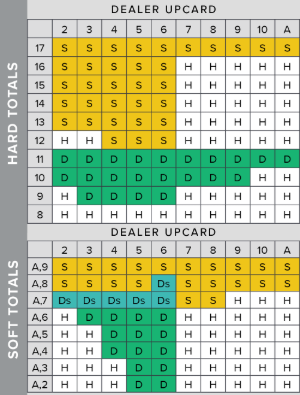
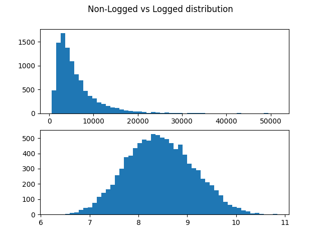

# BeatingTheCasino

Employing Python to run Blackjack strategies to beat the house.

In Blackjack, the house has a natural advantage due to the player always going before the dealer; this advantage can be upwards of 3% sometimes (depending on factors such as the amount of decks, how many decks are played before shuffling etc.). Given a house edge of 3%, the house will win 53% of time (not including draws), causing players to lose over longer playing sessions. There is however, methods the player can employ to diminish the house edge, and even sometimes gain an edge over the casino, allowing the player to win over the long run, and rinse these greedy casinos of their 'infinite' supply of money. This project aims to use Python coupled with data analysis techniques such as machine learning to test different strategies and help understand which might be the best method for the player to gain the greatest edge over the casino.

There are multiple rules for different casinos, however we can generalise most of them to look like this

1. The dealer always stands on any sum of cards greater then 16.
2. The amount of standard playing decks used vary from casino to casnio, usually from around 4-8 and the more decks, the harder it is for the player to gain an advantage as the game is more random/unpredictable.
3. Standard plays are hit, stand and double down (double bet after seeing first two cards, then can only hit once after).
4. When a player wins they are paid out 2-1 (i.e. 2x their original bet), apart from when they win with BlackJack (21), then they are paid out 3-1 (3x their original bet).
5. Player always hits first, and therefore, if they bust and the dealer also busts, the house still wins.

Strategies so far:

1. Basic Strategy - Mathematically the best moves as proved by mathemiticians over 50 years ago, consists of a table with dealers face card on x axis and players total count on the y axis. Simply look for your corresponding play and play it.

2. Card Counting - +1 for cards 2-6, 0 for cards 7-9, -1 for cards > 9 and depending on total count there are more high count cards or low count cards in the deck signifying when to bet more or less. By using machine learning we can try and understand when it is beneficial to bet more/less and hopefully make a profit.

<u>Basic Strategy</u>

NOTES:
Starting bal -> $1000
Bet size -> $10 (fixed for now)

Player wins -> 42.43%
Dealer wins -> 48.81%
Draws -> 8.76%
Games played -> 100,000,000

This is the stats for player winning with no doubling down or splitting.
This shows that the players expected win rate is 42.43% and clearly over a long period of time they do not expect to win. Without doubling down or splitting, the player is at a significant disadvantage.

By introducing doubling down, the player can bet more money on hands that are more likely to win, which means the player should expect to lose less and even win in some cases as they can leverage better hands to win more. This does not however mean that the player wins in the long run, as even with doubling down, the casino has an edge due to the player going before the dealer.

This means that even with perfect basic strategy in the long run its simply a matter of 'when' the player loses. I ran 10000 simulations and plotted them over a histogram to find on average after how many games a player can expect to lose. As shown below, I needed to perform a log transform on the data, as there are no negative values for games played.

